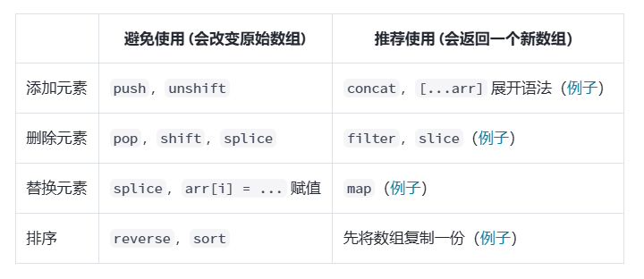

# React study

## 2025.8.19

1. How to create a react project（Vite）

    npm create vite@latest my-app -- --template react

2. How run it

    npm install

    npm run dev

3. Project Architecture

         my-app/
            node_modules/  # Dependencies
            public/ # Public Static Assets
            src/ # Main Code
              assets/ # Static Assets (images, fonts, CSS, etc.)
              components/ # Reusable Components
              App.jsx # Root Component
              main.jsx # Mount the Root Component to the Template HTML
              xx.css  # Style Files, written separately in a single file (different from Vue)
            index.html # Project Template HTML
            package.json # Records Information about the Project’s Dependency Packages
            package-lock.json # Dependency Lock File
            vite.config.js # Vite Configuration File
            .gitignore # Manage Git Commits and Pushes

4. Git study node

    (1). git 用于多人协作开发时的代码版本控制工具。其将代码存储区分为三个区域
  
         工作区：也就是整个工程文件夹下
         暂存区：在工作区使用git init指令之后即形成暂存区，暂存区会和工作区的文件内容进行哈希值计算
           当哈希值不同时，即工作区的内容还未更新到暂存区时，这些未更新到暂存区的改动在vscode中会有非常明显的标志
         本地仓库：存放着代码的各个版本

    (2). 常用的git指令与对应的解释

         git init #初始化git
         git add 文件名1 文件名2 #添加文件到暂存区
         git add . #将当前目录及其子目录下所有变动都添加
         git add -A #把所有变动都添加
         git commit -m "描述信息" #提交到本地仓库
         git status #查看当前状态
         git log #查看提交记录

         以下仅在初次连接远程仓库时使用：
         git remote add origin https://github.com/username/my-project.git #将本地仓库连接到远程仓库 origin是远程仓库名
         git branch -M main #创建仓库分支main
         git push -u origin main #将代码上传到远程仓库

         后续改动与上传：
         git add
         git commit -m ""
         git push

         git push -u origin 分支名 #将代码推送到远程仓库的新分支中，并且此后一直与此分支保持连接
         git checkout -b 分支名 #创建并切换到本地新分支

         注意：git push时会把本地当前分支上所有被commit的内容提交到远程仓库的分支中
         这样就可以一天中多次commit，工作结束时一次push

         git branch #查看本地分支信息，※标记的是当前所在本地分支
         git brach -vv #查看本地分支与远程分支的对应信息
         git checkout 分支名 #切换本地分支
         注意：由于不同分支代码版本不同，所以切换分支之前一定要先将修改commit。切换到其他分支后由于版本不同代码会变化要先知。

         git合并分支与提交远程仓库

         git status #确认所有修改以提交
         git checkout main #切换本地主分支
         git pull origin main #保持本地主分支与远程主分支同步，防止冲突
         git merge 本地分支名 #合并本地分支到main
         git push origin main #推送到远程main

## 2025.8.20

1.  React的新语法结构：JSX，其相当于JavaScript + XML。其中XML是一种类HTML的数据传输格式

语法规则例：

  function App() { #定义App组件
 
  const names = ["Mike","Sarah","James"]

  return (
    <> #必须有唯一的根元素
      

        <ul> #HTML定义结构
          {
            names.map(function(e,i){
              return <li>{e}</li>  #JS定义数据展示和交互规则
            })
          }
        </ul>
      

    </>
  )
}

2.  条件渲染

function App() {

  const flag = true

  return (
    <>
      {flag?
show
:
hide
}
    </>
  )
}

3.  组件的定义与使用

方式一：函数组件

const Banner = (props) =>{
    return 
函数式组件

}

export default Banner;

方式二：类组件

import React from "react";
export default class Header extends React.Component{
    render(){
        return(
            

                类组件
            

        )
    }
}

使用方式：

import Header form "";

\<Header />

4.  组件通信1

父组件：

\<Banner name = "jackey" age = "24"/>

子组件：

const Banner = (props) =>{

    return (
        <>
        \
函数式组件

        \
今天是: {formatDate()}

        \
名字：{props.name}

        \
年龄：{props.age}

        </>
    )
    
}

5.  组件通信2

function AlertButton({ children }) {

  return (

    <button>
      {children}
    </button>
  );

}

export default function Toolbar() {

  return (

    

      <AlertButton>
        播放电影
      </AlertButton>
      <AlertButton>
        上传图片
      </AlertButton>
    

  );
}

※如上所示，父组件在使用子组件时，可以在标签中加入文本信息，这些文本信息会在子组件中被当作children数据项读取。

## 2025.8.21

1.  &&运算符的活用

    function Item({ name, isPacked }) {

      return (

        <li className="item">
           {name} {isPacked && '✅'} ##当isPacked为true时，✅会被渲染
        </li>
     );
}

2.  列表渲染

  假设存在以下数据：

  const people = 
  [{
  id: 0,
  name: '凯瑟琳·约翰逊',
  profession: '数学家',
}, {
  id: 1,
  name: '马里奥·莫利纳',
  profession: '化学家',
}, {
  id: 2,
  name: '穆罕默德·阿卜杜勒·萨拉姆',
  profession: '物理学家',
}, {
  id: 3,
  name: '珀西·莱温·朱利亚',
  profession: '化学家',
}, {
  id: 4,
  name: '苏布拉马尼扬·钱德拉塞卡',
  profession: '天体物理学家',
}];

通过filter筛选数据：

const chemists = people.filter(person =>
  person.profession === '化学家' 
);

通过map便利数据：

const listItems = chemists.map(
  person =>
  \<li>
     \
    \

       <b>{person.name}:</b>
       {' ' + person.profession + ' '}
       因{person.accomplishment}而闻名世界
     

  </li>
);

※注意1：列表的每一项都需要一个唯一的key，而且最好不要使用索引当作key

※注意2：在任何位置，return一个组件时，都要有一个根容器，如：

   return (

    <article>
      {poem.lines.map((line, index) => #哪怕是箭头函数的隐式return，也要加根容器
       

        {index>0?
:''}
         

          {line}
         

       

      )}
    </article>

  );

## 2025.8.25

1. 保持组件纯粹性

let guest = 0;

function Cup() {

  // Bad：正在更改预先存在的变量！

  guest = guest + 1;

  return \<h2>Tea cup for guest #{guest}\</h2>;

}

export default function TeaSet() {
  return (

    <>
      <Cup />
      <Cup />
      <Cup />
    </>

  );
}

如上所示，在一个组件中最好不要尝试改变组件之外的变量。

此即为组件的纯粹性

## 2025.8.26

1.  响应事件

简单来说就是如何在组件上绑定监听事件。方法如下：

  export default function Button() {

  function handleClick() {

    alert('你点击了我！');

  }

  return (

    <button onClick={handleClick}>
      点我
    </button>

  );
}

※需要注意的是，onClick属性中需要传递函数，而不是调用函数

❌: onClick={handleClick()}

2.  将事件函数作为props传递

function Button({ onClick, children }) {

  return (
    
    <button onClick={onClick}>
      {children}
    </button>
  );
}

function UploadButton() {

  return (

    <Button onClick={() => alert('正在上传！')}>
      上传图片
    </Button>
  );
}

3.  事件传播与阻止传播

export default function Toolbar() {

  return (

    
 {
      alert('你点击了 toolbar ！');
    }}>
      <button onClick={() => alert('正在播放！')}>
        播放电影
      </button>
    

  );
}

※如上所示，当点击button之后，父节点（div）中的点击事件也会被触发。此之为事件传播。

※这种传播有时会带来不利影响，因此需要阻止其传播。

export default function Button() {

  return (

    
 {
      alert('点击了 toolbar');
    }}>
      <button onClick={(e) => {
        e.stopPropagation()
        alert("点击了button")
      }}>
        播放电影
      </button>
    

  );
}

※阻止方法为在子节点中加入 e.stopPropagation() 代码

4.  阻止事件触发时的默认行为

export default function Signup() {

  return (

    <form onSubmit={e => {
      e.preventDefault();
      alert('提交表单！');
    }}>
      <input />
      <button>发送</button>
    </form>
  );
}

※如上所示，使用 e.preventDefault() 可以阻止表单提交时的重新加载页面的行为

## 2025.8.27

1.  state变量

※如下代码所示普通的局部变量既无法在重新渲染中持久保持，其更改也不会触发重新渲染。

export default function Gallery() {
  let index = 0; ※index作为一个普通的局部变量，其改变无法触发重新渲染，也无法在重新渲染中保持。

  function handleClick() {
    index = index + 1;
  }

  return (

    <>
      <button onClick={handleClick}>
        Next
      </button>
      

        index
      

    </>
  );
}

※此时需要引入state变量来达到以上效果，引入方法如下：

import { useState } from 'react';

const [index, setIndex] = useState(0); ※useState函数返回一个数组，其中包含state变量(index，初始值为0)和对应的setter函数(setIndex)

function handleClick() {

  setIndex(index + 1); ※使用setter函数修改state变量

}

2.  Hook函数

※一类特殊的函数，以use开头，上述useState即使其中一个
※只能在组件最顶层调用，不能在条件或循环语句中使用 (Error:Rendered fewer hooks than expected. )
※const [index, setIndex] = useState(0) 类似于一个声明函数，index, setIndex，以及index的初始值均可自定义

3.  state的构建原则

         (1). 合并关联的state
         const [position, setPosition] = useState({ x: 0, y: 0 });

         ※如上面的例子中，坐标x和y总是同时存在同时修改的，因此完全可以把它们构建为一个对象，修改的方法为：

         setPosition({
          x: e.clientX,
          y: e.clientY
        });

        (2). 避免state冗余
        export default function Form() {
          const [firstName, setFirstName] = useState('');
          const [lastName, setLastName] = useState('');
          const [fullName, setFullName] = useState('');

          function handleFirstNameChange(e) {
               setFirstName(e.target.value);
               setFullName(e.target.value + ' ' + lastName);
          }

          function handleLastNameChange(e) {
               setLastName(e.target.value);
               setFullName(firstName + ' ' + e.target.value);
          }

          ※如上面的例子，FullName这个state是冗余的，因为每次改变FirstName或者LastName的时候，会重新触发渲染，因此直接计算FullName就行：

          const fullName = firstName + ' ' + lastName;

          (3).避免重复的state
          ※当存在重复的state时，若其中一处修改，另一处忘记修改的话，就会导致数据冲突
          
          (4).扁平化state
          ※当数据嵌套的太深会不利于state的更新，可以尝试将它们进行扁平化处理。

          (5).避免过度使用state
          State 变量仅用于在组件重渲染时保存信息。在单个事件处理函数中，普通变量就足够了。当普通变量运行良好时，不要引入 state 变量。

3.  state的更新方法

      export default function Counter() {

      const [number, setNumber] = useState(0);

        return (

          <>
          <h1>{number}</h1>
          <button onClick={() => {
             setNumber(number + 1);
             setNumber(number + 1);
             setNumber(number + 1);
          }}>+3</button>
          </>
        )
      }

      ※如上所示，在点击button后，number不会实际+3，而只会+1。原因是，每次setNumber执行时，先读取当前的number为0，然后在下次重新渲染时(onClick的处理函数执行完毕后)更改为1。

## 2025.8.28

1.  React中的组件渲染

        (1).触发渲染
            1°.初次渲染：初次启动应用时触发
            2°.状态更新渲染：通过set函数更改状态时触发
        (2).开始渲染
            1°.初次渲染：对根组件进行渲染
            2°.状态更新渲染：仅渲染状态更新相关的组件
        (3).DOM更新
            1°.初次渲染：提交所有DOM节点
            2°.状态更新渲染：仅更新与状态更新相关的DOM
        (4).浏览器绘制
            DOM更新结束后，浏览器会重新绘制(painting)屏幕

2.  state的更新特性

export default function Counter() {

  const [number, setNumber] = useState(0);

  return (

    <>
      <h1>{number}</h1>
      <button onClick={() => {
        setNumber(number + 5);
        setTimeout(() => {
          alert(number);
        }, 3000);
      }}>+5</button>
    </>
  )
}

※在上述代码中，点击按钮3秒后alert的内容并不是5，而是0
※这个例子说明了，在一段代码的一次执行时，一个state变量是一个恒定的“快照”，不会随时间或者其他任何东西的改变而改变。它的改变反映在重新渲染后，再重新执行这段代码时。

## 2025.8.29

1.  state更新队列

const [number, setNumber] = useState(0);

        return (

          <>
          <h1>{number}</h1>
          <button onClick={() => {
             setNumber(number + 1);
             setNumber(number + 1);
             setNumber(number + 1);
          }}>+3</button>
          </>
        )

※在这个例子中，点击事件结束重新渲染后，number变为1而不是3。这告诉了我们只有在事件处理函数中所有代码执行结束之后才会更新UI。

※然而有时候我们可能会需要改变这个“没来得及更新的state”，可以使用以下的方法进行。

return (

    <>
      <h1>{number}</h1>
      <button onClick={() => {
        setNumber(n => n + 1);
        setNumber(n => n + 1);
        setNumber(n => n + 1);
      }}>+3</button>
    </>
  )

※n=>n+1被称为更新函数。其执行逻辑为,n代表state当前值（更新队列中的state），哪怕它暂时还没有被更新，仍然可以被n储存和迭代。

return (

    <>
      <button onClick={() => {
        setNumber(number + 5);
        setNumber(n => n + 1);
      }}>
    </>
  )

※上面这个例子更容易看出来state的更新逻辑。
※首先number被自增5，并添加到更新队列中。而n=>n+1则直接从更新队列中取出自增5后的number，再自增1。因此点击按钮之后，页面会显示6。

2.  state的更新特性

return (

    async function handleClick() {
      setCompleted(number+1);
      await delay(3000);
  }
  )

※在上面的代码中，无论点击得有多快，number始终及时刷新。说明state的更新不会等待延迟函数。

3.  更改对象类型的state数据

const [position, setPosition] = useState({x: 0,y: 0});

※以上代码将一个对象类型的数据作为state数据，在修改时

onPointerMove={e => {setPosition({x: e.clientX,y: e.clientY});}}

※需要像这样再创建一个对象作为修改。而下面的修改方法是无法触发重新渲染的：

onPointerMove={e => {position.x = e.clientX;position.y = e.clientY;}}

4.  对象展开语法与对象型state数据的修改

※state对象中若包含较多数据项，则可结合对象展开语法对state数据进行修改，像这样：

 const [person, setPerson] = useState(
  {

    firstName: 'Barbara',
    lastName: 'Hepworth',
    email: 'bhepworth@sculpture.com'
  });

setPerson({

      ...person, //对象展开语法

      firstName: e.target.value
    });

5.  state嵌套对象的更新

※对于以下的嵌套对象，若仅想更新其中的某一小项（city）

const [person, setPerson] = useState({

  name: 'Niki de Saint Phalle',

  artwork: {

    title: 'Blue Nana',
    city: 'Hamburg',
    image: 'https://i.imgur.com/Sd1AgUOm.jpg',
  }
})

※可以使用以下方法

const nextArtwork = { ...person.artwork, city: 'New Delhi' };

const nextPerson = { ...person, artwork: nextArtwork };

setPerson(nextPerson);

6.  Immer库

※在更新嵌套对象时，使用Immer库可以更加简便

npm install use-immer //安装

//使用：

import { useImmer } from 'use-immer';

export default function Form() {

  const [person, updatePerson] = useImmer({

    name: 'Niki de Saint Phalle',
    artwork: {
      title: 'Blue Nana',
      city: 'Hamburg',
      image: 'https://i.imgur.com/Sd1AgUOm.jpg',
    }
  });

  function handleNameChange(e) {

    updatePerson(draft => {
      draft.name = e.target.value;
    });
  }

  ## 2025.9.1

1.  state数组的更新

    ※首先需要知道的是，state数组和对象一样，单纯地更改其中的某个值是无法引起重新渲染的

    ※因此，更新的关键在于重新创建一个数组，如下：

    

2.  向数组中添加元素

    let nextId = 0;

    const [artists, setArtists] = useState([]);

    <button onClick={() => {
        artists.push({
          id: nextId++,
          name: name,
        });
      }}>添加\</button>

    ※如上所示，点击按钮之后，由于数组没有被替换，因此不会触发重新渲染

    ※正确的更新方法如下：

    setArtists([
          ...artists,
          { id: nextId++, name: name }
        ]);

3.  从数组中删除元素

    ※最简单的方法就是筛选过滤法，返回一个筛选后的数组：

    setArtists(
      artists.filter(a => a.id !== artist.id)
    );

    ※上代码中artist.id即是要删除的元素的id

4.  更改数组中的某些元素

    function handleClick() {

    const nextShapes = shapes.map(shape => {

      if (shape.type === 'square') {

        // 不作改变
        return shape;
      } else {

        // 返回一个新的圆形，位置在下方 50px 处
        return {
          ...shape,
          y: shape.y + 50,
        };
      }
    });

    setShapes(nextShapes);

  }

  ※如上所示，可使用map函数遍历整个数组，然后依次修改要修改的项目，最后将返回的数组作为setShapes函数的参数即可达到目的。

  5.  在数组任何位置插入元素

    function handleClick() {

    const insertAt = 1; // 可能是任何索引
    const nextArtists = [
      // 插入点之前的元素：
      ...artists.slice(0, insertAt),
      // 新的元素：
      { id: nextId++, name: name },
      // 插入点之后的元素：
      ...artists.slice(insertAt)
    ];
    setArtists(nextArtists);
    setName('');
  }

  ※如上所示，使用slice函数，对原数组进行剪切和拼接，创造新数组即可。

  6.  数组的翻转与排序

      ※正常情况下，JavaScript中的reverse方法和sort方法是不会返回一个新数组的，所以可以先拷贝一个数组，处理完整之后再赋值给setArray函数，如下：

      function handleClick() {

          const nextList = [...list];
          nextList.reverse();
          setList(nextList);
      }

      ※但是需要注意的是，当list中的数据为对象类型时，[...list]这样的浅复制可能会带来问题，如下：

      const nextList = [...list];

      nextList[0].seen = true; // 问题：list[0]也会被改变

      setList(nextList);

      ※因此，在处理对象类型的数据时需要格外小心，一定要确保新建一个对象，再对它进行修改。当然也可以使用Immer修改。

  ## 2025.9.2

  1.  声明式UI与命令式UI

      ※简而言之，命令式UI需要写好一堆判断逻辑，当触发某种条件之后，去执行预先创建好的函数。“告诉系统每一步怎么走”。
      
        async function handleFormSubmit(e) {

          e.preventDefault();
          disable(textarea);
          disable(button);
          show(loadingMessage);
          hide(errorMessage);
            try {
              await submitForm(textarea.value);
              show(successMessage);
              hide(form);
            } catch (err) {
              show(errorMessage);
              errorMessage.textContent = err.message;
            } finally {
              hide(loadingMessage);
              enable(textarea);
              enable(button);
            }
        }

      ※而声明式UI则需要预先定义好系统状态变量，当系统处于某种状态时，相应的UI会自动被渲染出来。如本文件夹下的Guess组件所示。

## 2025.9.3

  1.  组件间共享变量

    ※情况分析：现有两个信息展示域，点击展开其中一个，另一个必须关闭展示。

    import { useState } from 'react';

    export default function Accordion() {
        const [activeIndex, setActiveIndex] = useState(0);
        return (
            <>
            <h2>哈萨克斯坦，阿拉木图</h2>
            <Panel
              title="关于"
              isActive={activeIndex === 0}
              onShow={() => setActiveIndex(0)}
            >
              阿拉木图人口约200万，是哈萨克斯坦最大的城市。它在 1929 年到 1997 年间都是首都。
            </Panel>
            <Panel
              title="词源"
              isActive={activeIndex === 1}
              onShow={() => setActiveIndex(1)}
            >
            这个名字来自于 алма，哈萨克语中“苹果”的意思，经常被翻译成“苹果之乡”。事实上，阿拉木图的周边地区被认为是苹果的发源地，<i lang="la">Malus sieversii</i> 被认为是现今苹果的祖先。
            </Panel>
        </>
        );
    }

      function Panel({
        title,
        children,
        isActive,
        onShow
      }) {
        return (
          <section className="panel">
            <h3>{title}</h3>
            {isActive ? (
              
{children}

            ) : (
              <button onClick={onShow}>
                显示
              </button>
            )}
          </section>
        );
      }

      ※如上代码所示，在父组件Accordion中，为子组件传入isActive变量，控制它们的显示与隐藏。
      ※在点击每个板块的按钮时，将处理函数留在了父组件中。通过修改父组件的共同变量，同时控制两个子组件的状态。

  

